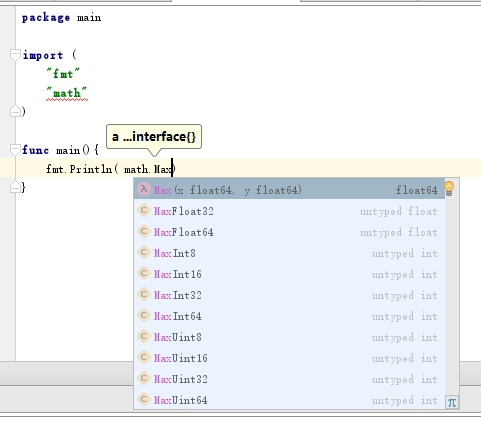

# 类型别名

在 go 语言中，可以对类型设置别名。即使系统已经自带的别名类型，例如 `byte 和 rune`。

语法格式为  `type 别名 类型 `

> 在 `type newint int` 中，严格意义上来说， `newint` 并不是 `int` 的别名，而只是底层数据结构相同，这这里成为**自定义**类型，在类型转换时仍旧需要显示转换。

```go
package main

import "fmt"

/*  type 别名 类型 */

//type byte int8   /* 重新定义 byte 的类型  */

//type rune int32   /* 重新定义 rune 的类型  */

type 文本 string

func main() {
	var b 文本 = "使用的是中文定义的啊，亲"
	fmt.Println(b)
}


/* 结果

使用的是中文定义的啊，亲

*/

```


# 类型零值

零值并不等于空置，而是当变量被声明为某种类型后的默认值，通常情况下的默认值为
+ 数值类型 : 0 
+ 布尔类型 ：false
+ string类型 : 空字符串


```go
package main

import (
	"fmt"
)

//var a int
//var b string
//var c bool

var (
	v_int int
	v_float float32
	v_byte byte


	v_string string
	v_bool bool

	v_array []int  // slice 切片。如果没有指定数组大小的话，就会变成切片
	v_array1 [2]int  // 因为数据的类型为数值类型，因此零值使用的是整数型的结果 .

	v_array_string []string
	v_array_string1 [3]string
)

func main() {
	fmt.Println("v_int default value = ", v_int)
	fmt.Println("v_float default value = ", v_float)
	fmt.Println("v_byte default value = ", v_byte)
	fmt.Println("v_string default value = ", v_string)
	fmt.Println("v_bool default value = ", v_bool)
	fmt.Println("v_array default value = ", v_array)
	fmt.Println("v_array1 default value = ", v_array1)
	fmt.Println("v_array_string default value = ", v_array_string)
	fmt.Println("v_array_string1 default value = ", v_array_string1)

}


/* 结果 

v_int default value =  0
v_float default value =  0
v_byte default value =  0
v_string default value =  
v_bool default value =  false
v_array default value =  []
v_array1 default value =  [0 0]
v_array_string default value =  []
v_array_string1 default value =  [  ]

*/

```


# 检查值的边界

在 go 语言中，可以使用 `math` 包的中的功能检查数字边界



```
package main

import (
	"fmt"
	"math"
)

func main() {
	fmt.Println(math.MaxInt8)
	fmt.Println(math.MinInt16)
}


/* 结果

127
-32768

*/
```
